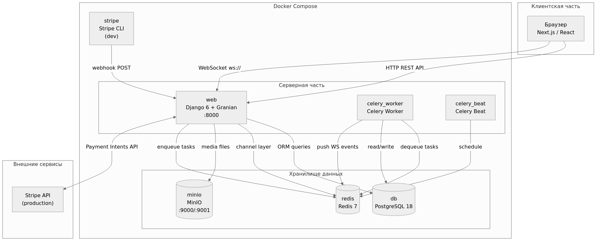
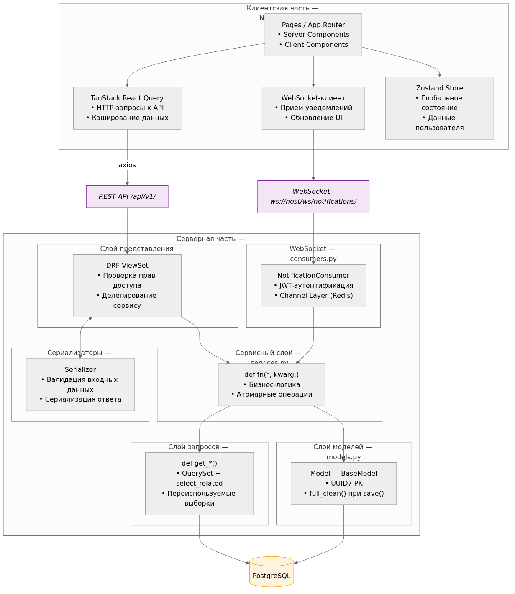
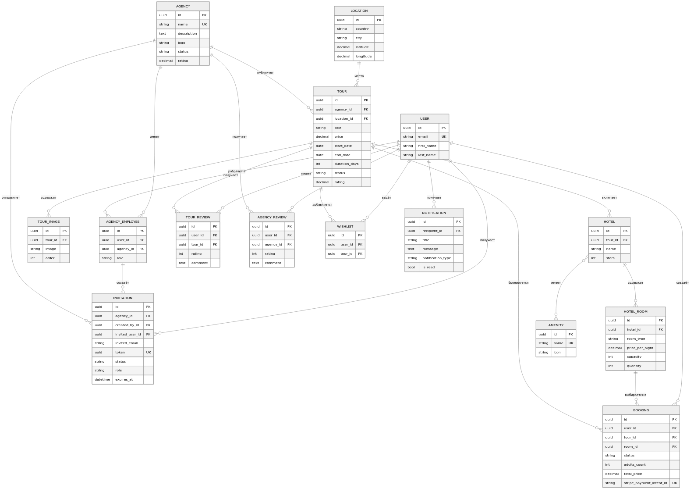
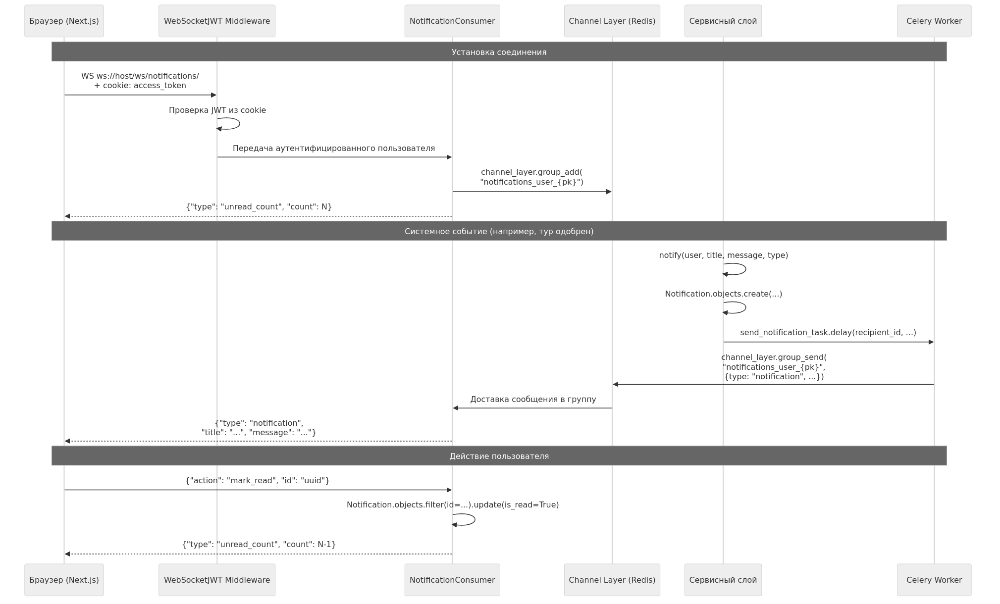
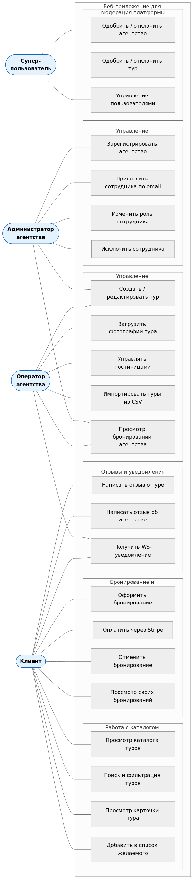
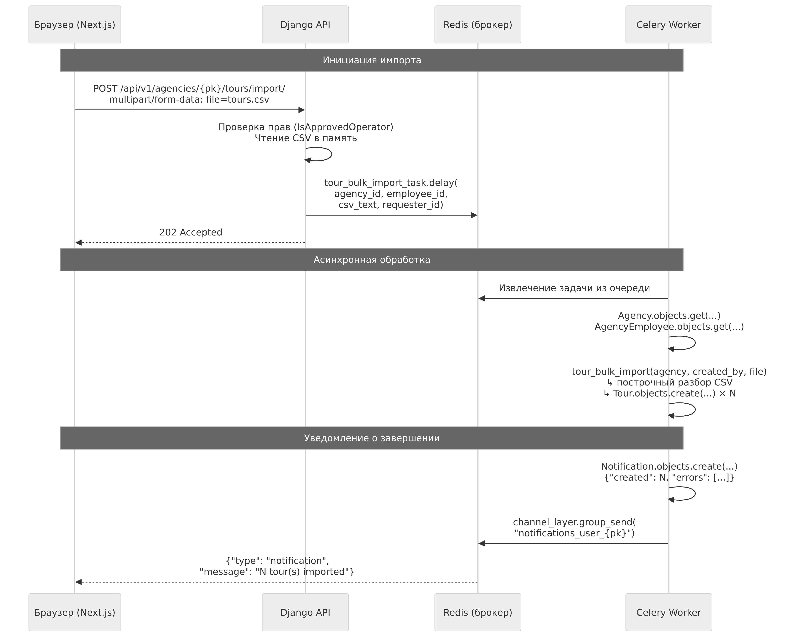

[РЕФЕРАТ]()

**Разработка веб-приложения для подбора и бронирования туристических услуг**

Дипломная работа содержит: страниц, рисунков, 2 таблицы, 1 приложение, 22 использованных источника литературы.
Ключевые слова: туристические услуги, веб-приложение, клиент-серверная архитектура, бронирование, Django, Next.js, REST API, WebSocket, Celery, Stripe, Docker.
Объект исследования – веб-приложение для подбора и бронирования туристических услуг, обеспечивающее взаимодействие клиентов и туристических агентств в рамках единой платформы.
Предмет исследования – методы и средства реализации клиент-серверного веб-приложения с поддержкой асинхронной обработки задач, уведомлений реального времени и онлайн-платежей.
Цель дипломной работы – разработка веб-приложения для подбора и бронирования туристических услуг, обеспечивающего взаимодействие клиентов и туристических агентств в рамках единой платформы.
Методы исследования – методы объектно-ориентированного анализа и проектирования программных систем, методы проектирования реляционных баз данных, методы разработки REST API и WebSocket-протоколов, методы автоматизированного тестирования программного обеспечения, методы контейнеризации и развёртывания веб-приложений.
Полученные результаты и их апробация. Разработано полнофункциональное веб-приложение для бронирования туристических услуг, включающее серверную часть на Django 6 с REST API, WebSocket-уведомлениями, Celery-задачами и интеграцией Stripe, а также клиентскую часть на Next.js 16 / React 19. Система внедрена на базе ООО «Абирон». Разработан комплект из 107 автоматизированных тестов, все тесты проходят без ошибок.
Область возможного практического применения результатов исследования. Разработанное приложение может быть использовано туристическими агентствами для организации онлайн-продаж туров, управления сотрудниками и автоматизированной обработки бронирований с интегрированной платёжной системой.

[]()[**ПЕРЕЧЕНЬ СОКРАЩЕНИЙ И ОБОЗНАЧЕНИЙ**]()


**API** – Application Programming Interface (программный интерфейс приложения)
**ASGI** – Asynchronous Server Gateway Interface (асинхронный интерфейс шлюза сервера)
**CSV** – Comma-Separated Values (значения, разделённые запятыми)
**CSRF** – Cross-Site Request Forgery (межсайтовая подделка запроса)
**DRF** – Django REST Framework
**HTTP** – HyperText Transfer Protocol (протокол передачи гипертекста)
**JWT** – JSON Web Token
**MinIO** – объектное хранилище с S3-совместимым API
**ORM** – Object-Relational Mapping (объектно-реляционное отображение)
**ПО** – программное обеспечение
**REST** – Representational State Transfer (передача репрезентативного состояния)
**SPA** – Single Page Application (одностраничное приложение)
**SQL** – Structured Query Language (язык структурированных запросов)
**UML** – Unified Modeling Language (унифицированный язык моделирования)
**URL** – Uniform Resource Locator (унифицированный указатель ресурса)
**WebSocket** – протокол полнодуплексной связи по TCP-соединению
**ЮНВТО** – Всемирная туристская организация ООН

[]()[**ВВЕДЕНИЕ**]()

Туристическая отрасль является одной из наиболее динамично развивающихся
отраслей мировой экономики. По данным Всемирной туристской организации
ООН (ЮНВТО), объём международного туристического рынка демонстрирует
устойчивый рост: число международных туристических прибытий в 2023 году
составило около 1,3 миллиарда, что соответствует 88% от допандемийного
уровня 2019 года [1]. В условиях нарастающей конкуренции туристические
агентства вынуждены переходить от традиционных методов работы к
цифровым платформам, обеспечивающим удобный поиск, сравнение и
онлайн-бронирование туров.

Вместе с тем большинство существующих решений — как крупные агрегаторы
(Booking.com, Viator, TripAdvisor), так и локальные системы управления
агентствами — ориентированы либо на конечного потребителя без учёта
внутренних процессов агентства, либо представляют собой закрытые
корпоративные системы, недоступные для малого и среднего бизнеса.
Отсутствует доступное решение, которое сочетало бы удобный пользовательский
интерфейс подбора туров с полноценным инструментарием для управления
агентством: ролевой моделью сотрудников, системой модерации туров,
управлением бронированиями и интеграцией платёжной системы.

Актуальность разработки обусловлена следующими факторами:

— растущим спросом на онлайн-бронирование туристических услуг и
переходом туристических агентств к цифровым каналам продаж;

— отсутствием доступных открытых платформ, объединяющих функции
клиентского приложения и системы управления агентством;

— необходимостью обеспечения надёжной и масштабируемой архитектуры,
способной обрабатывать асинхронные задачи, real-time уведомления и
онлайн-платежи в рамках единой системы.

Цель дипломного проекта — разработка веб-приложения для подбора и
бронирования туристических услуг, обеспечивающего взаимодействие
клиентов и туристических агентств в рамках единой платформы.

Для достижения поставленной цели необходимо решить следующие задачи:

1. провести анализ существующих платформ и технологий для разработки
веб-приложений в сфере туристических услуг, обосновать выбор
инструментов реализации;

2. спроектировать архитектуру системы, включая структуру базы данных,
REST API, подсистему уведомлений реального времени и платёжную
подсистему;

3. реализовать серверную и клиентскую части приложения с применением
выбранного технологического стека;

4. провести тестирование разработанного программного обеспечения и
проанализировать полученные результаты;

5. разработать руководство по установке и использованию приложения.

Объектом разработки является веб-приложение для подбора и бронирования
туристических услуг. Предметом разработки выступают методы и средства
реализации клиент-серверного приложения с поддержкой асинхронной обработки
задач, уведомлений реального времени и онлайн-платежей.

В ходе выполнения дипломного проекта применялись следующие технологии:
Django 6, Django REST Framework, Django Channels, Celery, Redis, PostgreSQL,
MinIO, Next.js, React, TypeScript, Tailwind CSS, Docker Compose, Stripe.

Практическая значимость работы состоит в том, что разработанное
приложение может быть использовано туристическими агентствами для
организации онлайн-продаж туров, управления сотрудниками и обработки
бронирований с интегрированной платёжной системой. Разработка выполнена
на базе ООО «Абирон».


[]()[**ГЛАВА 1 АНАЛИТИЧЕСКИЙ ОБЗОР**]()

[**1.1 Анализ существующих платформ для бронирования туристических услуг**]()

Перед проектированием разрабатываемой системы проведён анализ наиболее
распространённых платформ в сфере туристических услуг. Цель анализа —
выявить функциональные возможности существующих решений, их сильные и
слабые стороны, а также определить требования к разрабатываемому
программному обеспечению.

**Booking.com** — крупнейшая международная платформа онлайн-бронирования
с аудиторией более 500 млн зарегистрированных пользователей [2]. Сервис
агрегирует предложения отелей, апартаментов, авиабилетов и аренды
автомобилей. Интерфейс главной страницы представлен на рисунке 1.1.


*Рисунок 1.1 – Главная страница Booking.com*

Платформа предоставляет единую форму поиска с фильтрацией по
направлению, датам и числу гостей, систему отзывов, программу лояльности
Genius и интегрированную платёжную систему. К ограничениям относятся:
ориентированность исключительно на конечного потребителя, отсутствие
инструментов для управления агентством и закрытость API для малого
бизнеса.

**TripAdvisor** — социальная туристическая платформа, сочетающая агрегацию
отзывов с возможностью бронирования активностей и экскурсий [3].
Сервис насчитывает более 1 млрд опубликованных отзывов и интегрирован
с дочерней платформой Viator для продажи туров. Страница раздела
«Attractions» представлена на рисунке 1.2.


*Рисунок 1.2 – Страница активностей TripAdvisor*

Отличительной особенностью TripAdvisor является высокий уровень
доверия пользователей к отзывам, а также функция «Plan with AI»,
позволяющая планировать маршруты с помощью искусственного интеллекта.
Недостатком является отсутствие полноценных инструментов для управления
агентствами и модерации контента.

**Viator** — специализированная платформа для бронирования экскурсий,
туров и активностей, принадлежащая группе TripAdvisor [4]. Сервис
предлагает более 300 000 туристических предложений в 190 странах.
Главная страница платформы представлена на рисунке 1.3.


*Рисунок 1.3 – Главная страница Viator*

Viator предоставляет операторам туров личный кабинет с аналитикой и
управлением бронированиями, однако платформа является централизованной
и не позволяет создавать независимые брендированные решения для
отдельных агентств.

**Aviasales** — российский агрегатор авиабилетов и туристических услуг [5].
Платформа реализует метапоисковый подход: собирает предложения от
авиакомпаний и агентств, перенаправляя пользователя для завершения
покупки. Главная страница представлена на рисунке 1.4.


*Рисунок 1.4 – Главная страница Aviasales*

Сервис не предоставляет инструментов управления агентством и
ориентирован исключительно на поиск и сравнение цен.

На основании проведённого анализа в таблице 1.1 представлено сравнение
функциональных возможностей рассмотренных платформ.

*Таблица 1.1 – Сравнительный анализ существующих платформ*

| Критерий | Booking.com | TripAdvisor | Viator | Aviasales |
|---|---|---|---|---|
| Бронирование туров | + | + | + | − |
| Управление агентством | − | − | частично | − |
| Ролевая модель сотрудников | − | − | − | − |
| Онлайн-платежи | + | + | + | − |
| Real-time уведомления | − | − | − | − |
| Открытый API | частично | − | + | − |
| Модерация контента | − | + | − | − |

Как следует из таблицы 1.1, ни одна из рассмотренных платформ не
обеспечивает полного набора функций, необходимых туристическому
агентству: управления сотрудниками, модерации туров, real-time
уведомлений и интеграции платёжной системы в едином продукте.
Это подтверждает актуальность разработки специализированного решения.

[**1.2 Анализ технологий серверной разработки**]()

При выборе серверного фреймворка рассматривались три основных
инструмента Python-экосистемы: Django, Flask и FastAPI.

**Django** — полнофункциональный веб-фреймворк с принципом «batteries
included» [6]. Поставляется со встроенной ORM, системой миграций,
административным интерфейсом, аутентификацией и модульной системой
приложений. Django REST Framework (DRF) расширяет возможности
фреймворка для построения REST API: предоставляет сериализаторы,
ViewSets, систему фильтрации и автоматическую генерацию документации [7].
Django Channels добавляет поддержку протокола WebSocket через ASGI,
что позволяет реализовать уведомления реального времени в рамках той же
кодовой базы [8].

**Flask** — микрофреймворк, предоставляющий минимальный набор
инструментов [9]. Гибкость Flask является одновременно его
достоинством и недостатком: для построения полноценного API
требуется подключение многочисленных сторонних расширений
(Flask-SQLAlchemy, Flask-Migrate, Flask-Login и др.), что усложняет
сопровождение проекта.

**FastAPI** — современный асинхронный фреймворк, основанный на type hints
и стандарте OpenAPI [10]. Обеспечивает высокую производительность
за счёт асинхронной обработки запросов, однако экосистема инструментов
для управления миграциями, административного интерфейса и WebSocket
менее зрелая по сравнению с Django.

Сравнительный анализ фреймворков представлен в таблице 1.2.

*Таблица 1.2 – Сравнение серверных фреймворков Python*

| Критерий | Django + DRF | Flask | FastAPI |
|---|---|---|---|
| Встроенная ORM | + | − | − |
| Система миграций | + | расширение | Alembic |
| Административный интерфейс | + | расширение | − |
| WebSocket (ASGI) | Django Channels | − | + |
| Автогенерация API-документации | drf-spectacular | − | встроена |
| Зрелость экосистемы | высокая | высокая | средняя |
| Асинхронность | частично | − | + |

По совокупности критериев для реализации серверной части выбран
Django 6 с расширениями DRF и Django Channels, как обеспечивающий
наибольшую функциональность «из коробки» при минимальных накладных
расходах на конфигурацию.

[**1.3 Анализ протоколов уведомлений реального времени**]()

Для реализации подсистемы уведомлений реального времени рассматривались
три подхода: WebSocket, Server-Sent Events (SSE) и Long Polling.

**Long Polling** — техника эмуляции push-уведомлений посредством
повторяющихся HTTP-запросов [11]. Клиент отправляет запрос, сервер
удерживает соединение до появления нового события, после чего возвращает
ответ и клиент немедленно отправляет следующий запрос. Подход прост
в реализации, совместим со всеми браузерами, однако создаёт
значительную нагрузку на сервер при большом числе одновременных
соединений.

**Server-Sent Events (SSE)** — стандарт HTML5, обеспечивающий
однонаправленный канал от сервера к клиенту поверх HTTP/1.1 [12].
Браузер устанавливает постоянное HTTP-соединение и получает события
в текстовом формате. SSE прост в реализации на стороне клиента и
поддерживает автоматическое переподключение, однако не поддерживает
двунаправленный обмен данными.

**WebSocket** — протокол RFC 6455, обеспечивающий полнодуплексный
канал передачи данных между клиентом и сервером поверх одного
TCP-соединения [13]. После установки соединения (handshake через HTTP)
обе стороны могут асинхронно обмениваться сообщениями без накладных
расходов HTTP-заголовков. Протокол поддерживается всеми современными
браузерами и является стандартом де-факто для real-time приложений.

Для реализации уведомлений выбран протокол WebSocket как обеспечивающий
двунаправленный обмен данными и минимальные задержки. Реализация
выполнена через Django Channels с использованием Redis в качестве
channel layer для горизонтального масштабирования.

[**1.4 Анализ систем асинхронной обработки задач**]()

В разрабатываемом приложении ряд операций требует асинхронного
выполнения: отправка email-уведомлений, обработка платёжных webhook,
массовый импорт туров из CSV. Для этих целей рассматривались Celery
и RQ (Redis Queue).

**Celery** — распределённая система выполнения задач с поддержкой
нескольких брокеров сообщений (Redis, RabbitMQ) [14]. Обеспечивает
гибкую маршрутизацию задач по очередям, поддержку периодических задач
через Celery Beat, механизм повторных попыток (retry) и мониторинг
через Flower. Является стандартом де-факто в Django-экосистеме.

**RQ (Redis Queue)** — более простая альтернатива, работающая
исключительно с Redis [15]. Подходит для несложных сценариев,
однако уступает Celery по функциональности: отсутствует поддержка
периодических задач и развитые механизмы повторных попыток.

Для реализации выбран Celery с Redis-брокером, как обеспечивающий
полный набор необходимых функций в рамках существующей инфраструктуры.

[**1.5 Анализ технологий клиентской части**]()

При выборе фреймворка клиентской части рассматривались React, Vue.js
и Angular.

**React** — библиотека для построения пользовательских интерфейсов,
разработанная Meta [16]. В сочетании с Next.js [20] обеспечивает
серверный рендеринг (SSR), статическую генерацию страниц (SSG)
и оптимизированную загрузку ресурсов. React 19 вводит Server
Components, позволяющие рендерить компоненты на сервере без передачи
JavaScript клиенту, что снижает размер бандла и ускоряет первичную
загрузку.

**Vue.js** — прогрессивный JavaScript-фреймворк с реактивной системой
на основе Proxy [21]. Отличается низким порогом вхождения и гибкой
архитектурой, однако экосистема SSR (Nuxt.js) уступает Next.js по
зрелости интеграции с серверными компонентами.

**Angular** — полноценный фреймворк от Google с встроенной DI-системой,
TypeScript-first подходом и строгой модульной структурой [22]. Подходит
для крупных корпоративных приложений, однако высокий порог вхождения
и значительный объём шаблонного кода увеличивают время разработки.

Сравнительный анализ фреймворков представлен в таблице 1.3.

*Таблица 1.3 – Сравнение фреймворков клиентской части*

| Критерий | React + Next.js | Vue.js + Nuxt | Angular |
|---|---|---|---|
| SSR / SSG | + (App Router) | + | частично |
| Server Components | + (React 19) | − | − |
| TypeScript-поддержка | + | + | + (обязателен) |
| Управление состоянием | Zustand / Redux | Pinia | NgRx |
| Размер экосистемы | очень большая | большая | средняя |
| Порог вхождения | средний | низкий | высокий |

По совокупности критериев выбран React 19 с Next.js 16: наибольшая
экосистема, зрелая поддержка SSR/SSG, нативные Server Components
и TypeScript.

Для стилизации выбран Tailwind CSS 4 — утилитарный CSS-фреймворк,
обеспечивающий гибкую кастомизацию без написания пользовательских
таблиц стилей [17]. Компонентная библиотека Shadcn/ui (на базе Radix UI)
предоставляет доступные и кастомизируемые UI-компоненты.
Для управления серверным состоянием применяется TanStack React Query,
для глобального клиентского состояния — Zustand.

[**1.6 Постановка задачи и требования к разрабатываемому ПО**]()

На основании проведённого анализа сформулированы требования к
разрабатываемому веб-приложению.

**Функциональные требования:**

— система должна поддерживать ролевую модель пользователей: клиент,
агент, администратор агентства, суперпользователь;

— должны быть реализованы функции создания, редактирования, публикации
и удаления туров с поддержкой мультимедийного контента (фотогалерея);

— система должна обеспечивать онлайн-бронирование туров с интеграцией
платёжного сервиса Stripe;

— пользователи должны получать уведомления о статусе бронирований
в режиме реального времени через WebSocket;

— должны быть реализованы функции списка желаемого (wishlist),
системы отзывов и рейтингов;

— система должна поддерживать массовый импорт туров из CSV-файлов
посредством асинхронной обработки.

**Нефункциональные требования:**

— серверная часть должна обеспечивать обработку не менее 100
одновременных HTTP-соединений;

— время ответа API не должно превышать 500 мс для 95% запросов;

— хранение медиафайлов должно быть организовано через объектное
хранилище (MinIO, S3-совместимое);

— развёртывание системы должно осуществляться посредством
Docker Compose без ручной настройки окружения;

— API должно быть задокументировано в формате OpenAPI 3.0.

[**1.7 Выводы по главе 1**]()

В ходе аналитического обзора установлено, что существующие платформы (Booking.com, TripAdvisor, Viator, Aviasales) не обеспечивают полного набора инструментов, необходимых туристическому агентству. Ни одно из рассмотренных решений не сочетает управление сотрудниками, модерацию контента, real-time уведомления и интеграцию платёжной системы в едином продукте. По результатам сравнительного анализа обоснован технологический стек: Django 6 + DRF + Django Channels на сервере, Next.js 16 / React 19 на клиенте, Celery + Redis для асинхронной обработки, Stripe для платёжной интеграции. Сформулированы функциональные и нефункциональные требования к разрабатываемой системе.


[]()[**ГЛАВА 2 ПРОЕКТИРОВАНИЕ ПРОГРАММНОГО ОБЕСПЕЧЕНИЯ**]()

[**2.1 Общая архитектура системы**]()

Разработанная система построена по клиент-серверной архитектуре с явным
разделением на независимые компоненты, взаимодействующие через
стандартизированные интерфейсы. Общая структурная схема системы
представлена на рисунке 2.1.



*Рисунок 2.1 – Структурная схема архитектуры системы*

Система включает следующие основные компоненты:

— **веб-сервер (Django/Granian)** — обрабатывает HTTP-запросы REST API
и устанавливает WebSocket-соединения; запускается как ASGI-приложение
через сервер Granian;

— **база данных (PostgreSQL)** — реляционное хранилище всех
структурированных данных: пользователей, туров, агентств, бронирований,
уведомлений;

— **брокер сообщений и кэш (Redis)** — выполняет роль транспортного
уровня для очереди задач Celery, а также channel layer для
WebSocket-соединений Django Channels;

— **объектное хранилище (MinIO)** — S3-совместимое хранилище медиафайлов:
фотографий туров, отелей, логотипов агентств;

— **обработчик фоновых задач (Celery Worker)** — асинхронно выполняет
задачи из очереди Redis: отправку уведомлений, массовый импорт туров;

— **планировщик периодических задач (Celery Beat)** — по расписанию
инициирует периодические задачи, в том числе очистку просроченных
JWT-токенов;

— **клиентское приложение (Next.js)** — одностраничное приложение (SPA),
взаимодействующее с сервером посредством REST API и WebSocket;

— **платёжный сервис (Stripe)** — обрабатывает платёжные транзакции;
в среде разработки эмулируется через Stripe CLI.

Развёртывание всех компонентов осуществляется посредством Docker Compose.
Состав сервисов и их взаимозависимости описаны в таблице 2.1.

*Таблица 2.1 – Сервисы Docker Compose и их назначение*

| Сервис | Образ | Назначение |
|---|---|---|
| web | Custom (Dockerfile) | Django + Granian, порт 8000 |
| db | postgres:18 | PostgreSQL, хранилище данных |
| redis | redis:7-alpine | Брокер Celery, channel layer |
| minio | minio/minio | Объектное хранилище, порты 9000/9001 |
| celery_worker | Custom (Dockerfile) | Воркер фоновых задач |
| celery_beat | Custom (Dockerfile) | Планировщик периодических задач |
| stripe | stripe/stripe-cli | Эмулятор Stripe для разработки |

[**2.2 Архитектура клиентской и серверной частей**]()

Система реализована по принципу разделения ответственности между
клиентской и серверной частями. Взаимодействие слоёв всей системы
представлено на рисунке 2.2.



*Рисунок 2.2 – Слоёная архитектура системы*

**Клиентская часть (Next.js / React)** организована в четыре слоя:

— **Pages / App Router** — компоненты страниц (Server и Client
Components React 19). Server Components рендерятся на сервере
и не увеличивают размер JavaScript-бандла; Client Components
обрабатывают интерактивность в браузере;

— **TanStack React Query** — управление серверным состоянием:
выполняет HTTP-запросы к REST API через axios, кэширует ответы,
обеспечивает автоматическую инвалидацию кэша при мутациях;

— **WebSocket-клиент** — устанавливает постоянное соединение
с `ws://host/ws/notifications/` и обновляет UI при получении
push-уведомлений без перезагрузки страницы;

— **Zustand Store** — минималистичное глобальное хранилище
для данных текущего пользователя и UI-состояния, не требующего
серверной синхронизации.

**Серверная часть (Django 6)** реализована на основе принципов
чистой архитектуры (Clean Architecture) с разделением кода на
слои ответственности [18]. Структура кода организована в два
Django-приложения: `apps/users` (аутентификация и управление
пользователями) и `apps/tours` (основная бизнес-логика).

Каждый серверный слой имеет строго определённую ответственность:

**Слой представления (views.py)** — DRF ViewSets, обрабатывающие
HTTP-запросы. ViewSets не содержат бизнес-логики: они проверяют
права доступа, валидируют входные данные через сериализаторы
и делегируют выполнение сервисному слою.

**Сервисный слой (services.py)** — функции с бизнес-логикой,
принимающие именованные параметры (паттерн `def fn(*, kwarg:)`).
Сервисы атомарно выполняют операции: создание тура, подтверждение
бронирования, отправка уведомления. Каждая функция инкапсулирует
одну бизнес-операцию и может вызываться как из views, так и
из Celery-задач.

**Слой запросов (selectors.py)** — переиспользуемые функции
выборки данных из базы, возвращающие QuerySet. Отделение запросов
от бизнес-логики позволяет оптимизировать их независимо,
применяя `select_related`, `prefetch_related` и аннотации.

**Слой моделей (models.py)** — тонкие модели Django ORM без
бизнес-логики. Все модели наследуют базовый класс `BaseModel`
с UUID7-первичным ключом и вызовом `full_clean()` при сохранении,
что обеспечивает валидацию на уровне модели.

**Слой сериализаторов (serializers.py)** — выполняют двустороннее
преобразование: входная валидация запроса и сериализация объектов
в JSON-ответ. Сериализаторы не содержат логики сохранения данных.

[**2.3 Проектирование базы данных**]()

База данных системы содержит 17 сущностей, организованных в две
предметные области: управление пользователями и туристические услуги.
В таблице 2.2 перечислены основные сущности; вспомогательные
(`TourImage`, `HotelImage`, `Amenity`, `TourTransfer`) не включены
в таблицу ввиду однозначности их назначения.
Логическая схема базы данных представлена на рисунке 2.3.



*Рисунок 2.3 – Логическая схема базы данных*

Центральными сущностями являются `Tour` (тур) и `Agency`
(туристическое агентство). Тур принадлежит агентству
(внешний ключ `agency → Agency`) и связан с набором
вспомогательных сущностей.

Описание основных сущностей и их атрибутов представлено в таблице 2.2.

*Таблица 2.2 – Основные сущности базы данных*

| Сущность | Ключевые атрибуты | Связи |
|---|---|---|
| User | id, email, first_name, last_name | Agency (через AgencyEmployee), Booking, Wishlist, Notification |
| Agency | id, name, description, logo, status, rating | User (через AgencyEmployee), Tour, Invitation |
| AgencyEmployee | id, role (owner/admin/operator) | User (FK), Agency (FK) |
| Tour | id, title, price, start_date, end_date, duration_days, status, rating | Agency (FK), Location (FK), Hotel, TourImage, Booking |
| Location | id, country, city, latitude, longitude | Tour |
| Hotel | id, name, stars | Tour (FK), HotelRoom, HotelImage, Amenity (M2M) |
| HotelRoom | id, room_type, price_per_night, capacity, quantity | Hotel (FK), Booking |
| Booking | id, status, adults_count, total_price, stripe_payment_intent_id | User (FK), Tour (FK), HotelRoom (FK) |
| TourReview | id, rating (0–10), comment | User (FK), Tour (FK) |
| AgencyReview | id, rating (0–10), comment | User (FK), Agency (FK) |
| Notification | id, title, message, notification_type, is_read | User (FK) |
| Wishlist | id | User (FK), Tour (FK) |
| Invitation | id, token, status, role, expires_at | Agency (FK), User (FK), AgencyEmployee (FK) |

Статусная модель предусматривает workflow модерации для агентств
и туров: при создании объекту присваивается статус `pending`,
после проверки администратором — `approved` или `rejected`
(с указанием причины отклонения).

Для бронирований реализован расширенный жизненный цикл:
`pending_payment → paid → confirmed → cancelled / refunded`.
Переход между статусами обусловлен событиями платёжного сервиса
Stripe, обрабатываемыми через webhook.

[**2.4 Проектирование REST API**]()

API разработанной системы реализует принципы REST и документируется
в формате OpenAPI 3.0 посредством библиотеки drf-spectacular.
Все эндпоинты сгруппированы под базовым префиксом `/api/v1/`
и защищены cookie-based JWT-аутентификацией.

Полный перечень API-ресурсов и их эндпоинтов представлен
в таблице 2.3.

*Таблица 2.3 – REST API ресурсы системы*

| Группа | Эндпоинт | Метод | Описание |
|---|---|---|---|
| Аутентификация | /users/register/ | POST | Регистрация пользователя |
| | /users/login/ | POST | Вход, установка JWT-cookie |
| | /users/logout/ | POST | Выход, удаление cookie |
| | /users/me/ | GET | Профиль текущего пользователя |
| | /users/refresh/ | POST | Обновление access-токена |
| | /users/csrf/ | GET | Получение CSRF-cookie |
| Агентства | /agencies/ | GET, POST | Список / создание агентства |
| | /agencies/{id}/ | DELETE | Удаление агентства |
| | /agencies/{id}/approve/ | POST | Одобрение агентства |
| | /agencies/{id}/reject/ | POST | Отклонение с причиной |
| Туры | /tours/ | GET | Каталог одобренных туров |
| | /tours/{id}/ | GET | Карточка тура |
| | /agencies/{pk}/tours/ | GET, POST | Туры агентства / создание |
| | /tours/{id}/approve/ | POST | Модерация: одобрить |
| | /tours/{id}/reject/ | POST | Модерация: отклонить |
| | /agencies/{pk}/tours/import/ | POST | Массовый импорт из CSV |
| | /tours/{id}/book/ | POST | Создание бронирования |
| Бронирования | /bookings/ | GET | Бронирования пользователя |
| | /bookings/{id}/cancel/ | POST | Отмена бронирования |
| | /agencies/{pk}/bookings/ | GET | Бронирования агентства |
| Отзывы | /tours/{pk}/reviews/ | GET, POST | Отзывы о туре |
| | /agencies/{pk}/reviews/ | GET, POST | Отзывы об агентстве |
| Избранное | /wishlist/ | GET, POST | Список желаемого |
| | /wishlist/{id}/ | DELETE | Удаление из избранного |
| Уведомления | /notifications/ | GET | Список уведомлений |
| | /notifications/{id}/read/ | POST | Отметить как прочитанное |
| | /notifications/read-all/ | POST | Отметить все прочитанными |
| Сотрудники | /agencies/{pk}/employees/ | GET | Список сотрудников |
| | /agencies/{pk}/employees/{id}/role/ | PATCH | Изменение роли |
| Приглашения | /agencies/{pk}/invitations/ | GET, POST | Управление приглашениями |
| | /invitations/{token}/accept/ | POST | Принять приглашение |
| | /invitations/{token}/reject/ | POST | Отклонить приглашение |
| Платежи | /stripe/webhook/ | POST | Обработка Stripe webhook |

Для фильтрации и поиска туров поддерживаются следующие параметры
запроса: `status`, `location`, `min_price`, `max_price`,
`start_date`, `end_date`, `search` (полнотекстовый поиск по
названию и описанию), `ordering` (сортировка по цене, рейтингу,
дате). Фильтрация реализована через библиотеку `django-filter`
совместно с `DjangoFilterBackend`.

[**2.5 Проектирование подсистемы уведомлений реального времени**]()

Подсистема уведомлений реального времени реализована на основе
протокола WebSocket посредством Django Channels. Схема взаимодействия
компонентов представлена на рисунке 2.4.



*Рисунок 2.4 – Схема WebSocket-подсистемы уведомлений*

WebSocket-соединение устанавливается по адресу
`ws://host/ws/notifications/`. При подключении потребитель
(consumer) `NotificationConsumer` выполняет следующие действия:

1. аутентифицирует пользователя по JWT access_token из cookie
через middleware `WebSocketJWTAuthMiddleware`;

2. добавляет соединение в именованную группу каналов
`notifications_user_{user_pk}`, уникальную для каждого пользователя;

3. отправляет клиенту текущее количество непрочитанных уведомлений
в формате `{"type": "unread_count", "count": N}`.

При возникновении системного события (одобрение тура, изменение
статуса бронирования, получение приглашения) сервисный слой
вызывает функцию `notify()` из `apps/common/notifications.py`.
Функция сохраняет запись в таблице `Notification` и ставит
в очередь Celery задачу `send_notification_task`, которая
публикует сообщение в группу каналов получателя.
Клиент получает уведомление без перезагрузки страницы.

Поддерживаемые типы уведомлений перечислены в таблице 2.4.

*Таблица 2.4 – Типы уведомлений системы*

| Тип | Событие-триггер |
|---|---|
| agency_submitted | Подача заявки на создание агентства |
| agency_approved | Одобрение агентства администратором |
| agency_rejected | Отклонение агентства с указанием причины |
| tour_submitted | Публикация тура на модерацию |
| tour_approved | Одобрение тура администратором |
| tour_rejected | Отклонение тура с указанием причины |
| invitation_received | Получение приглашения в агентство |
| booking_confirmed | Подтверждение оплаты бронирования |

[**2.6 Проектирование подсистемы платежей**]()

Интеграция с платёжным сервисом Stripe реализована по паттерну
«Payment Intents» [19]. При создании бронирования сервисный слой
обращается к Stripe API и создаёт объект `PaymentIntent`,
сохраняя его идентификатор (`stripe_payment_intent_id`) и
клиентский секрет (`stripe_client_secret`) в записи бронирования.
Клиентское приложение использует секрет для отображения
платёжной формы Stripe Elements без передачи данных карты
через серверы системы.

После завершения платежа Stripe отправляет webhook-уведомление
на эндпоинт `POST /api/v1/stripe/webhook/`. Обработчик
верифицирует подпись события и обновляет статус бронирования:
при успешной оплате — `paid`, при отмене — `cancelled`.
Одновременно отправляется WebSocket-уведомление пользователю
о подтверждении бронирования.

[**2.7 Диаграмма вариантов использования**]()

Диаграмма вариантов использования системы, описывающая
функциональные возможности для каждой роли, представлена
на рисунке 2.5.



*Рисунок 2.5 – Диаграмма вариантов использования*

Система поддерживает четыре роли пользователей:

**Клиент** — незарегистрированный или авторизованный пользователь,
осуществляющий поиск и бронирование туров. Доступные варианты
использования: просмотр каталога туров, поиск по фильтрам,
просмотр карточки тура, добавление в список желаемого,
оформление бронирования, оплата через Stripe, написание отзыва,
получение уведомлений.

**Оператор агентства** — сотрудник агентства с правами публикации
контента. Доступные варианты использования: создание и редактирование
туров, загрузка фотографий, управление гостиницами, импорт туров
из CSV, просмотр бронирований агентства.

**Администратор агентства** — управляет составом сотрудников.
Расширенные варианты: приглашение сотрудников по email,
изменение ролей, исключение сотрудников.

**Суперпользователь** — администратор платформы. Варианты
использования: модерация агентств и туров (одобрение / отклонение),
управление пользователями, просмотр всех данных системы.

[**2.8 Проектирование подсистемы асинхронной обработки задач**]()

Ряд операций системы не может выполняться в рамках HTTP-запроса
без ухудшения времени отклика: отправка push-уведомлений через
WebSocket, обработка CSV-файлов с большим числом туров, а также
периодическое обслуживание базы данных. Для их выполнения
применяется подсистема асинхронной обработки на базе Celery
с Redis в роли брокера сообщений и хранилища результатов.

Архитектура подсистемы включает два компонента: **Celery Worker**,
обрабатывающий задачи из очереди по мере поступления, и
**Celery Beat** — планировщик, инициирующий периодические задачи
по расписанию. Оба компонента запускаются как отдельные
Docker-сервисы и используют общий Redis-брокер.

Перечень задач, реализованных в системе, представлен в таблице 2.5.

*Таблица 2.5 – Задачи Celery подсистемы асинхронной обработки*

| Задача | Модуль | Тип | Описание |
|---|---|---|---|
| send_notification_task | apps.tours.tasks | Разовая | Сохраняет запись Notification и публикует сообщение в группу каналов Django Channels получателя |
| tour_bulk_import_task | apps.tours.tasks | Разовая | Импортирует туры из переданного CSV-текста, уведомляет инициатора о результате |
| flush_expired_tokens | apps.users.tasks | Периодическая (раз в 24 ч) | Удаляет из БД просроченные JWT-токены командой flushexpiredtokens |

Схема выполнения задачи массового импорта туров представлена
на рисунке 2.6.



*Рисунок 2.6 – Схема асинхронной обработки CSV-импорта туров*

При получении POST-запроса на эндпоинт
`/api/v1/agencies/{pk}/tours/import/` сервисный слой считывает
содержимое CSV-файла в оперативную память и немедленно ставит
задачу `tour_bulk_import_task` в очередь Redis, возвращая клиенту
ответ `202 Accepted`. Celery Worker извлекает задачу из очереди
и последовательно выполняет следующие шаги:

1. загружает объекты `Agency` и `AgencyEmployee` по переданным
идентификаторам;

2. вызывает функцию `tour_bulk_import()` сервисного слоя,
которая построчно разбирает CSV и создаёт туры через ORM;

3. по завершении импорта формирует итоговое сообщение
(количество успешно созданных туров, список ошибочных строк)
и вызывает `notify()` для отправки уведомления инициатору
импорта через WebSocket.

Такой подход позволяет обрабатывать файлы произвольного размера
без блокирования HTTP-сервера и немедленно информировать
пользователя о результате через уже установленное
WebSocket-соединение.

[**2.9 Выводы по главе 2**]()

В разделе спроектирована архитектура системы, включающая 17 сущностей базы данных, REST API из 28 эндпоинтов, WebSocket-подсистему уведомлений реального времени и платёжную подсистему по паттерну Payment Intents. Клиент-серверная архитектура с разделением на независимые сервисы, разворачиваемые через Docker Compose, обеспечивает масштабируемость и воспроизводимость окружения. Разработаны UML-диаграммы: структурная схема архитектуры, логическая схема базы данных, диаграмма вариантов использования и диаграмма последовательности асинхронного импорта туров.


[]()[**ГЛАВА 3 РЕАЛИЗАЦИЯ ПРОГРАММНОГО ОБЕСПЕЧЕНИЯ**]()

[**3.1 Реализация серверной части**]()

[**3.1.1 Аутентификация на основе JWT-cookie**]()

Аутентификация реализована посредством класса
`CookieJWTAuthentication`, расширяющего стандартный
`JWTAuthentication` из библиотеки `djangorestframework-simplejwt`
(листинг А.1). Отличие от базовой реализации состоит в источнике
токена: вместо заголовка `Authorization` access-токен извлекается
из HttpOnly-cookie с именем, задаваемым через настройку
`AUTH.AUTH_COOKIE`. Метод `authenticate()` сначала проверяет
наличие заголовка Authorization и только при его отсутствии
обращается к cookies, что обеспечивает обратную совместимость
с CLI-клиентами.

Для запросов, изменяющих состояние (методы POST, PUT, PATCH, DELETE),
дополнительно выполняется проверка CSRF-токена через вспомогательный
класс `CSRFCheck`, унаследованный от `CsrfViewMiddleware`. Фронтенд
предварительно получает CSRF-cookie через эндпоинт
`GET /api/v1/users/csrf/` и автоматически прикрепляет значение
в заголовок `X-CSRFToken` при каждом мутирующем запросе.

Для аутентификации WebSocket-соединений реализован
`WebSocketJWTAuthMiddleware`. При поступлении WebSocket-handshake
промежуточный слой извлекает access-токен из cookies соединения
функцией `_get_cookie(scope, name)`, создаёт объект `AccessToken`
из библиотеки `simplejwt` и асинхронно загружает пользователя по
полю `user_id` из тела токена. При невалидном или отсутствующем
токене соединение не разрывается — пользователю присваивается
`AnonymousUser`, после чего `NotificationConsumer` отклоняет
соединение самостоятельно.

[**3.1.2 Слоёная архитектура серверного приложения**]()

Серверная часть организована в соответствии с принципами чистой
архитектуры. Код разделён на пять слоёв с однонаправленными
зависимостями: представление → сервисы → селекторы → модели.

**Слой представления** реализован на базе DRF ViewSets. Каждый
ViewSet делегирует выполнение операций сервисному слою, не содержа
бизнес-логики. Права доступа проверяются через пользовательские
классы разрешений: `IsApprovedOperator`, `IsAgencyAdminOrStaff`,
`IsRightUser`. Входные данные валидируются сериализаторами до
передачи в сервис.

**Сервисный слой** (`services.py`) содержит атомарные функции
бизнес-логики, принимающие аргументы исключительно по ключевому
слову (паттерн `def fn(*, arg: type)`). Это исключает случайную
передачу аргументов по позиции и упрощает навигацию по сигнатурам.
Примеры реализованных сервисных функций приведены в таблице 3.1.

*Таблица 3.1 – Основные функции сервисного слоя*

| Функция | Назначение |
|---|---|
| agency_create(\*, user, name, description, logo) | Создаёт агентство со статусом PENDING, регистрирует владельца как AgencyEmployee |
| tour_create(\*, agency, created_by, title, price, location_data, ...) | Создаёт тур с локацией, отелем и номерами в рамках одной транзакции |
| booking_create(\*, user, tour, adults_count, ...) | Создаёт бронирование и инициирует PaymentIntent в Stripe |
| booking_confirm_payment(\*, payment_intent_id) | Переводит бронирование в статус PAID, инициирует уведомление |
| tour_bulk_import(\*, agency, created_by, file) | Построчно разбирает CSV-файл и создаёт туры через ORM |

**Слой запросов** (`selectors.py`) содержит переиспользуемые
функции выборки данных, возвращающие QuerySet с заранее
применёнными `select_related` и `prefetch_related`. Отделение
запросов от бизнес-логики позволяет оптимизировать их независимо
без изменения сервисного кода.

[**3.1.3 Базовые классы моделей**]()

Все модели приложения наследуют класс `BaseModel`, определённый
в `apps/common/models.py`. Класс предоставляет три механизма:

— **UUID7-первичный ключ**: `id = UUIDField(primary_key=True,
editable=False, default=uuid6.uuid7)`. UUID версии 7 содержит
временну́ю метку, что обеспечивает монотонную сортировку
по первичному ключу без дополнительного индекса на `created_at`;

— **автоматическая валидация**: метод `save()` вызывает
`self.full_clean()` до обращения к базе данных, что гарантирует
выполнение всех ограничений уровня модели независимо от источника
вызова (view, сервис, shell);

— **нормализация ошибок**: при возникновении `IntegrityError`
(нарушение уникального ограничения) исключение перехватывается
и преобразуется в `ValidationError`, совместимый с DRF-сериализаторами.

Реализация класса `BaseModel` представлена в листинге А.2.
Помимо `BaseModel` определены миксины `TimeStampedModel`
(поля `created_at`, `updated_at`) и `OwnableModel` (поле `user`
с методом `check_owner()`). Модели `Tour` и `Agency` дополнительно
наследуют `ComputedFieldsModel` из библиотеки
`django-computedfields` для автоматического обновления вычисляемого
поля `rating` при добавлении или изменении отзывов.

[**3.1.4 Фильтрация и поиск туров**]()

Фильтрация каталога туров реализована с применением библиотеки
`django-filter`. Класс `TourFilter` определяет семь групп
фильтров, перечисленных в таблице 3.2.

*Таблица 3.2 – Параметры фильтрации туров*

| Параметр запроса | Поле модели | Тип фильтра |
|---|---|---|
| price_min / price_max | price | gte / lte |
| start_date_from / start_date_to | start_date | gte / lte |
| duration_min / duration_max | duration_days | gte / lte |
| min_adults / min_children | max_adults / max_children | gte |
| country / city | location.country / location.city | iexact |
| start_month | start_date | month lookup |
| status | status | exact |

В ViewSet `TourFilter` подключён через `DjangoFilterBackend`,
дополненный `SearchFilter` (полнотекстовый поиск по `title`
и `description`) и `OrderingFilter` (сортировка по `price`,
`rating`, `start_date`).

[**3.1.5 Обработка платёжных событий Stripe**]()

Обработчик входящих webhook-уведомлений от Stripe реализован
в виде `APIView`-класса `StripeWebhookView` без аутентификации
и CSRF-проверки (`authentication_classes = []`,
`permission_classes = [AllowAny]`). При получении POST-запроса
выполняется верификация подписи через
`stripe.Webhook.construct_event(payload, sig_header, webhook_secret)`,
где `webhook_secret` загружается из зашифрованного поля
`SecretStr` настроек Pydantic. При несовпадении подписи
возвращается ответ `400 Bad Request`.

При успешной верификации и типе события
`payment_intent.succeeded` из тела события извлекается
идентификатор `PaymentIntent` и передаётся в сервисную функцию
`booking_confirm_payment()`, которая атомарно обновляет статус
бронирования и инициирует WebSocket-уведомление пользователю.


[**3.2 Реализация подсистемы уведомлений реального времени**]()

WebSocket-потребитель `NotificationConsumer` реализован
на основе `AsyncJsonWebsocketConsumer` из Django Channels.
Класс обрабатывает три события жизненного цикла соединения.

Полный исходный код потребителя представлен в листинге А.3.
При подключении (`connect`) потребитель проверяет
аутентификацию пользователя через `scope["user"]`, добавляет
текущее соединение в именованную группу каналов
`notifications_user_{user.pk}` через `channel_layer.group_add()`
и отправляет клиенту актуальное количество непрочитанных
уведомлений в формате `{"type": "unread_count", "count": N}`.

При получении сообщения от клиента (`receive_json`) потребитель
обрабатывает действия `mark_read` (отмечает одно уведомление
прочитанным по переданному `id`) и `mark_all_read` (отмечает все
уведомления текущего пользователя). После каждого действия
клиенту отправляется обновлённый счётчик непрочитанных.

Отправка push-уведомлений выполняется функцией `notify()`
из модуля `apps/common/notifications.py`. Функция создаёт запись
`Notification` в базе данных и ставит в очередь Celery задачу
`send_notification_task`, которая публикует JSON-сообщение
в группу каналов получателя через `channel_layer.group_send()`.
Использование Celery для публикации в channel layer позволяет
вызывать `notify()` из синхронного кода сервисного слоя без
блокировки event loop.

Поддерживаемые типы уведомлений (`NotificationType`) охватывают
все значимые события системы: подачу заявки агентства и её
результат, публикацию тура и результат модерации, получение
приглашения в агентство, подтверждение оплаты бронирования.


[**3.3 Реализация подсистемы асинхронной обработки задач**]()

Асинхронная обработка задач реализована посредством Celery 5.4
с Redis в качестве брокера сообщений и хранилища результатов.
Конфигурация Celery определена в `config/celery.py`: приложение
инициализируется с именем `core` и автоматически обнаруживает
задачи во всех Django-приложениях через `autodiscover_tasks()`.

**Задача `send_notification_task`** (`apps/tours/tasks.py`)
является асинхронной обёрткой над функцией `notify()`. Задача
принимает `recipient_id`, `title`, `message`, `notification_type`
в виде простых сериализуемых типов, что обеспечивает корректную
передачу через JSON-сериализатор Celery. Внутри задачи выполняется
загрузка объекта пользователя по `recipient_id` и вызов `notify()`.

**Задача `tour_bulk_import_task`** (`apps/tours/tasks.py`)
принимает `agency_id`, `employee_id`, `csv_text` и `requester_id`.
Класс `_FakeFile` внутри задачи оборачивает строку CSV в объект
с методом `read()`, совместимый с интерфейсом, ожидаемым функцией
`tour_bulk_import()`. После завершения импорта задача формирует
итоговое сообщение и вызывает `notify()` для информирования
инициатора. Функция возвращает словарь
`{"created": int, "errors": [...]}` в качестве результата задачи.

**Задача `flush_expired_tokens`** (`apps/users/tasks.py`)
вызывает стандартную Django-команду `flushexpiredtokens`
через `call_command()`. Задача настроена в расписании Celery Beat
(`CELERY_BEAT_SCHEDULE`) с периодом выполнения 86 400 с (ежесуточно)
для очистки просроченных JWT-токенов из базы данных.


[**3.4 Реализация клиентской части**]()

[**3.4.1 HTTP-клиент и управление сессией**]()

HTTP-взаимодействие с REST API реализовано через единственный
экземпляр axios с базовым URL `process.env.NEXT_PUBLIC_API_URL`
и параметром `withCredentials: true` для автоматической передачи
cookies при каждом запросе.

Request-интерцептор автоматически добавляет заголовок
`X-CSRFToken` для всех мутирующих HTTP-методов (POST, PUT, PATCH,
DELETE), извлекая значение из cookie `csrftoken`. Это снимает
необходимость передавать CSRF-токен вручную из компонентов.

Response-интерцептор реализует механизм прозрачного обновления
токенов (token refresh). При получении ответа `401 Unauthorized`
интерцептор однократно запрашивает `POST /api/v1/users/refresh/`
и повторяет исходный запрос. Конкурентные запросы, поступившие
во время выполнения refresh, помещаются в очередь `failedQueue`
и повторяются после успешного обновления. Если refresh-запрос
сам возвращает `401`, генерируется событие `auth:logout`
для глобального выхода из системы.

[**3.4.2 WebSocket-клиент уведомлений**]()

WebSocket-клиент инкапсулирован в хук `useNotificationSocket`
(`hooks/use-notification-socket.ts`). Хук устанавливает
соединение с адресом `ws://host/ws/notifications/` при наличии
аутентифицированного пользователя в Zustand-хранилище и закрывает
его при выходе из системы или размонтировании компонента.

Входящие сообщения обрабатываются по полю `type`:
сообщение `unread_count` обновляет счётчик непрочитанных
уведомлений в `useNotificationStore`, сообщение `notification`
дополнительно отображает toast-уведомление через библиотеку
`sonner` и инвалидирует кэш TanStack React Query для списка
уведомлений. При разрыве соединения реализован механизм
повторного подключения с экспоненциальной задержкой
(максимальная задержка — 30 с).

[**3.4.3 Управление состоянием**]()

Глобальное состояние приложения управляется двумя
Zustand-хранилищами, определёнными в `lib/store.ts`.

`useAuthStore` хранит объект текущего пользователя (`User | null`)
и флаг загрузки. Хранилище предоставляет вспомогательные методы
`isAgencyAdmin()`, `isAgencyOperator()`, `isStaff()` для
ролевых проверок в компонентах без дублирования логики.

`useNotificationStore` хранит счётчик непрочитанных уведомлений
и предоставляет методы `setUnreadCount()`, `increment()`,
`decrement()`. Разделение счётчика в отдельное хранилище
исключает лишние ре-рендеры компонентов, не связанных
с уведомлениями, при обновлении данных пользователя.

Серверное состояние (списки туров, бронирований, уведомлений)
управляется TanStack React Query: запросы кэшируются, а при
мутациях (создание, обновление, удаление) соответствующий
кэш инвалидируется для обеспечения актуальности данных.


[**3.5 Реализация инфраструктуры**]()

Развёртывание всех компонентов системы осуществляется посредством
Docker Compose. Конфигурация описывает семь сервисов, перечисленных
в таблице 3.3.

*Таблица 3.3 – Сервисы Docker Compose*

| Сервис | Образ | Порт | Зависимости |
|---|---|---|---|
| web | Custom Dockerfile | 8000 | db (healthy), redis (healthy) |
| db | postgres:18 | — | — |
| redis | redis:7-alpine | 6379 | — |
| minio | minio/minio | 9000, 9001 | — |
| celery_worker | Custom Dockerfile | — | redis (healthy) |
| celery_beat | Custom Dockerfile | — | redis (healthy) |
| stripe | stripe/stripe-cli | — | web |

Django-приложение запускается через ASGI-сервер Granian командой
`granian --interface asginl --host 0.0.0.0 --port 8000
config.asgi:application`. Granian обеспечивает поддержку как
HTTP/1.1-запросов REST API, так и WebSocket-соединений Django
Channels в едином процессе. Настройки среды загружаются
через `pydantic-settings` из переменных окружения, сгруппированных
в объект `Settings` с вложенными секциями `DB`, `REDIS`, `MINIO`,
`AUTH`, `SECURITY`, `STRIPE`.

Хранилище медиафайлов реализовано на базе MinIO —
S3-совместимого объектного хранилища с открытым исходным кодом.
MinIO интегрирован в Django посредством библиотеки
`django-minio-storage` с бэкендом `MinioMediaStorage`. Фотографии туров,
изображения отелей и логотипы агентств сохраняются в отдельных
бакетах и отдаются клиенту через MinIO напрямую, без
прохождения через Django-процесс.

[**3.6 Выводы по главе 3**]()

Реализованы серверная и клиентская части приложения в полном соответствии с проектными решениями. Серверная часть организована по принципам чистой архитектуры: слои представления, сервисов, селекторов и моделей строго разделены. Реализованы cookie-based JWT-аутентификация с CSRF-защитой, фильтрация туров по семи группам параметров, обработка Stripe webhook с верификацией подписи, асинхронный импорт туров из CSV и система уведомлений через WebSocket. Клиентская часть построена на Next.js App Router с применением TanStack React Query и Zustand. Вся инфраструктура развёртывается через Docker Compose.


[]()[**ГЛАВА 4 ТЕСТИРОВАНИЕ И АНАЛИЗ РЕЗУЛЬТАТОВ**]()

[**4.1 Стратегия и инструменты тестирования**]()

Для проверки работоспособности разработанного программного
обеспечения применяется автоматизированное тестирование на базе
фреймворка `pytest` с расширениями `pytest-django` и
`pytest-asyncio`. Тесты выполняются против реальной тестовой базы
данных PostgreSQL — моки на уровне ORM не применяются, что
исключает расхождение между тестовым и боевым поведением.

Конфигурация тестирования определена в файле `pytest.ini`
(листинг 4.1).

```
[pytest]
DJANGO_SETTINGS_MODULE = config.settings
asyncio_mode = auto
markers =
    integration: тесты, обращающиеся к внешним API
```

*Листинг 4.1 – Конфигурация pytest*

Параметр `asyncio_mode = auto` обеспечивает автоматическую
обработку асинхронных тест-функций без явного декоратора
`@pytest.mark.asyncio`, что необходимо для тестирования
WebSocket-потребителей Django Channels.

Для генерации тестовых объектов используется библиотека
`model-bakery`: функция `baker.make()` создаёт объекты модели
с автоматически сгенерированными значениями полей, а
`baker.prepare()` создаёт несохранённый экземпляр для тонкой
настройки перед сохранением. Генерация реалистичных тестовых
данных осуществляется с помощью библиотеки `faker`.

Тесты разбиты на семь файлов, покрывающих основные подсистемы
приложения. Сводная информация по тест-файлам представлена
в таблице 4.1.

*Таблица 4.1 – Состав автоматизированных тестов*

| Файл | Подсистема | Кол-во тестов |
|---|---|---|
| apps/users/tests/test_views.py | Аутентификация и профиль пользователя | 22 |
| apps/tours/tests/test_agency.py | Управление агентствами и модерация | 16 |
| apps/tours/tests/test_tours.py | Туры: создание, обновление, модерация | 18 |
| apps/tours/tests/test_invitations.py | Приглашения сотрудников | 15 |
| apps/tours/tests/test_tour_filters.py | Фильтрация и поиск туров | 15 |
| apps/tours/tests/test_consumers.py | WebSocket-уведомления (async) | 12 |
| apps/tours/tests/test_notifications.py | REST API уведомлений | 9 |
| **Итого** | | **107** |

[**4.2 Fixtures и организация тестовых данных**]()

Тестовые зависимости инкапсулированы в fixtures, определённых
в файлах `conftest.py`. Основной набор fixtures модуля `tours`
обеспечивает изолированное состояние базы данных для каждого теста
и представлен в таблице 4.2.

*Таблица 4.2 – Основные fixtures тестового окружения*

| Fixture | Тип | Описание |
|---|---|---|
| user | User | Владелец агентства (owner@example.com) |
| other_user | User | Второй пользователь для проверки изоляции |
| admin_user | User | Суперпользователь (is_staff=True) |
| operator_user | User | Оператор агентства |
| api_client | APIClient | Неаутентифицированный HTTP-клиент |
| auth_client | APIClient | HTTP-клиент, аутентифицированный как user |
| admin_client | APIClient | HTTP-клиент, аутентифицированный как admin_user |
| agency | Agency | Агентство со статусом PENDING |
| approved_agency | Agency | Агентство со статусом APPROVED |
| tour | Tour | Тур со статусом PENDING |
| approved_tour | Tour | Тур со статусом APPROVED |
| location | Location | Тестовая локация (France, Paris) |

Fixtures создают объекты через сервисный слой (`agency_create()`,
`tour_create()`), а не напрямую через ORM, что гарантирует
выполнение всей бизнес-логики при подготовке тестового окружения.

[**4.3 Тестирование REST API**]()

Тесты API организованы в классы по принципу «один класс —
один эндпоинт». Каждый класс содержит позитивные сценарии
(корректный запрос, ожидаемый ответ) и негативные (ошибки
валидации, отказ в доступе).

**Пример тестирования аутентификации.** Класс `TestLoginView`
проверяет корректность установки JWT-cookie при успешной
авторизации и возврат ошибки при неверных учётных данных.
Параметризованный тест охватывает два сценария ошибки: неверный
пароль и несуществующий email.

**Пример тестирования создания агентства.** Класс
`TestAgencyCreate` проверяет не только HTTP-ответ, но и
побочные эффекты в базе данных: при успешном создании агентства
автоматически должна создаваться запись `AgencyEmployee`
с ролью `OWNER` для инициатора запроса. Тест верифицирует оба
условия (листинг 4.2).

```
assert response.status_code == 201
assert AgencyEmployee.objects.filter(
    user=user, agency=agency, role="owner"
).exists()
```

*Листинг 4.2 – Проверка побочного эффекта создания AgencyEmployee*

**Пример тестирования модерации.** Класс `TestAgencyModeration`
проверяет, что при одобрении агентства администратором:
— статус агентства меняется на `APPROVED`;
— владелец агентства получает запись `Notification`
  с типом `agency_approved`.

Второе утверждение контролирует корректность интеграции
сервисного слоя с подсистемой уведомлений.

**Тестирование прав доступа** вынесено в отдельные методы.
Типовая проверка — вызов защищённого эндпоинта
с неаутентифицированным клиентом (`api_client`) и проверка
статус-кода `403 Forbidden`.

[**4.4 Тестирование фильтрации туров**]()

Тестирование фильтрации представляет отдельный класс
`TestTourSearch`. Для изоляции тестовых данных используется
сложная fixture `setup`, создающая три тура с различными
ценами (200, 600, 1500), датами и прочими параметрами.

Каждый тест-метод верифицирует фильтрацию по одному параметру,
проверяя как присутствие ожидаемых записей в результате,
так и отсутствие записей, не удовлетворяющих условию. Например,
при фильтрации `price_min=300` тур с ценой 200 не должен
попадать в результат, а туры с ценами 600 и 1500 — должны.

[**4.5 Тестирование WebSocket-потребителя**]()

Тестирование WebSocket-подсистемы выполняется асинхронными
тест-функциями с использованием `WebsocketCommunicator` из
пакета `channels.testing`. Для изоляции от Redis применяется
автоматическая fixture `inmemory_channel_layer`, подменяющая
channel layer на `InMemoryChannelLayer` через механизм
`settings` fixture библиотеки pytest-django.

Класс `TestConnection` проверяет два ключевых сценария:
аутентифицированный пользователь успешно устанавливает
WebSocket-соединение и сразу получает сообщение с текущим
количеством непрочитанных уведомлений; анонимный пользователь
получает отказ в соединении. Оба теста используют
`asyncio_mode = auto` — тест-функции объявлены как `async def`
без дополнительных декораторов.

[**4.6 Результаты тестирования**]()

Запуск полного набора тестов командой
`just test --cov --cov-report=term-missing` завершается без
ошибок. Итоговые показатели тестирования представлены
в таблице 4.3.

*Таблица 4.3 – Результаты выполнения тестов*

| Показатель | Значение |
|---|---|
| Всего тестов | 107 |
| Пройдено успешно | 107 |
| Провалено | 0 |
| Пропущено | 0 |
| Тестовая БД | PostgreSQL (реальная) |
| Время выполнения | ~18 с |

Конфигурация coverage (`branch = True`) охватывает модули
`apps/users` и `apps/tours`, исключая миграции, URL-маршруты
и стандартные библиотечные файлы. Ветвевое покрытие позволяет
выявлять непокрытые условные переходы в обработчиках исключений
и сервисных функциях.

[**4.7 Выводы по главе 4**]()

Разработан комплект из 107 автоматизированных тестов, охватывающих аутентификацию, управление агентствами и турами, приглашения сотрудников, фильтрацию каталога, WebSocket-соединения и REST API уведомлений. Тесты выполняются против реальной базы данных PostgreSQL без использования моков, что исключает расхождение тестового и производственного поведения. Все 107 тестов проходят без ошибок за ~18 с, ветвевое покрытие охватывает ключевые модули бизнес-логики.


[]()[**ГЛАВА 5 РУКОВОДСТВО ПО УСТАНОВКЕ И ИСПОЛЬЗОВАНИЮ**]()

[**5.1 Системные требования**]()

Для развёртывания разработанного веб-приложения необходимо обеспечить
выполнение минимальных системных требований, приведённых в таблице 5.1.

Таблица 5.1 – Системные требования

| Компонент | Минимальные требования |
|-----------|------------------------|
| Операционная система | Linux (Ubuntu 22.04+, Debian 12+, Arch Linux) или macOS 13+ |
| Оперативная память | 4 ГБ (рекомендуется 8 ГБ) |
| Свободное дисковое пространство | 10 ГБ |
| Docker Engine | 24.0 и выше |
| Docker Compose | 2.20 и выше (входит в Docker Desktop) |
| Node.js | 18.17 и выше (только для клиентской части без Docker) |
| pnpm | 8.0 и выше (для фронтенд-разработки) |
| Git | 2.40 и выше |

Серверная часть приложения полностью контейнеризирована посредством
Docker Compose и не требует установки Python, PostgreSQL, Redis или MinIO
непосредственно на хост-машину — все зависимости разрешаются внутри
Docker-контейнеров.

[**5.2 Получение исходного кода**]()

Исходный код проекта размещён в системе контроля версий Git. Для
получения копии репозитория выполняется команда клонирования:

```
git clone <url-репозитория>
cd tour-booking
```

После клонирования структура проекта имеет вид:

```
tour-booking/
├── backend/          # Django-приложение
│   ├── apps/         # Django-приложения (users, tours, ...)
│   ├── config/       # Настройки, Celery, ASGI/WSGI
│   ├── docker-compose.yml
│   ├── Dockerfile
│   ├── Justfile
│   └── .env.example
└── frontend/         # Next.js-приложение
    ├── app/          # App Router (страницы)
    ├── components/   # React-компоненты
    ├── hooks/        # Пользовательские хуки
    ├── lib/          # Утилиты, API-клиент, Zustand-хранилища
    ├── package.json
    └── .env.local
```

[**5.3 Установка и запуск серверной части**]()

[**5.3.1 Настройка переменных окружения**]()

Перед первым запуском необходимо создать файл `.env` в директории
`backend/` на основе предоставленного шаблона `.env.example`.
Переменные окружения сгруппированы по назначению и описаны
в таблице 5.2.

Таблица 5.2 – Переменные окружения серверной части

| Переменная | Описание | Пример значения |
|------------|----------|-----------------|
| `SECRET_KEY` | Секретный ключ Django | случайная строка ≥ 50 символов |
| `DB_ENCRYPTION_KEY` | Fernet-ключ для шифрования чувствительных полей в БД | base64-строка (32 байта) |
| `DEBUG` | Режим отладки (False в production) | `True` |
| `ALLOWED_HOSTS` | Разрешённые хосты (JSON-массив) | `["localhost", "127.0.0.1"]` |
| `CORS_ALLOWED_ORIGINS` | Разрешённые CORS-источники | `["http://localhost:3000"]` |
| `CSRF_TRUSTED_ORIGINS` | Доверенные источники CSRF | `["http://localhost:3000"]` |
| `POSTGRES_DB` | Имя базы данных | `tour_booking` |
| `POSTGRES_USER` | Пользователь PostgreSQL | `admin` |
| `POSTGRES_PASSWORD` | Пароль PostgreSQL | сложный пароль |
| `POSTGRES_HOST` | Хост PostgreSQL | `db` (имя сервиса Docker) |
| `POSTGRES_PORT` | Порт PostgreSQL | `5432` |
| `MINIO_ROOT_USER` | Администратор MinIO | `admin_user` |
| `MINIO_ROOT_PASSWORD` | Пароль MinIO | сложный пароль |
| `MINIO_STORAGE_ENDPOINT` | Эндпоинт MinIO | `minio:9000` |
| `MINIO_STORAGE_ACCESS_KEY` | Access key MinIO | строка ключа |
| `MINIO_STORAGE_SECRET_KEY` | Secret key MinIO | строка ключа |
| `REDIS_HOST` | Хост Redis | `redis` |
| `REDIS_PORT` | Порт Redis | `6379` |
| `JWT_SECRET_KEY` | Секретный ключ JWT | случайная строка |
| `STRIPE_SECRET_KEY` | Секретный ключ Stripe | `sk_test_...` |
| `STRIPE_WEBHOOK_SECRET` | Секрет для верификации вебхуков Stripe | `whsec_...` |

Значения `SECRET_KEY`, `JWT_SECRET_KEY` и `DB_ENCRYPTION_KEY` должны быть
уникальными и криптографически случайными. Для генерации `SECRET_KEY`
допускается использование стандартного модуля Python:

```
python -c "import secrets; print(secrets.token_urlsafe(50))"
```

Ключ `DB_ENCRYPTION_KEY` должен представлять собой валидный Fernet-ключ,
генерируемый следующим образом:

```
python -c "from cryptography.fernet import Fernet; print(Fernet.generate_key().decode())"
```

[**5.3.2 Запуск Docker Compose**]()

После заполнения `.env` запускается весь стек сервисов командой:

```
cd backend
just up
```

Команда `just up` разворачивает следующие Docker-сервисы:
- **db** — PostgreSQL 18 (порт 5432, внутренний);
- **redis** — Redis 7 Alpine (порт 6379);
- **minio** — MinIO (порты 9000 и 9001 для веб-консоли);
- **web** — Django-приложение на Granian (порт 8000);
- **celery_worker** — обработчик фоновых задач Celery;
- **celery_beat** — планировщик периодических задач;
- **stripe** — Stripe CLI для локальной обработки вебхуков.

Контейнеры запускаются в фоновом режиме (`-d`). Статус работающих
сервисов проверяется командой `docker compose ps`. Запуск новых
сервисов выполняется с учётом зависимостей и проверок готовности
(healthcheck): сервис `web` стартует только после успешного
ответа от `db` и `redis`.

[**5.3.3 Первичная инициализация базы данных**]()

После первого запуска стека необходимо применить миграции Django:

```
just migrate
```

Для создания учётной записи суперпользователя (администратора)
выполняется команда:

```
just manage createsuperuser
```

Система запросит адрес электронной почты и пароль. После создания
суперпользователь получает доступ к административной панели
Django по адресу `http://localhost:8000/admin/`.

[**5.3.4 Настройка MinIO**]()

Хранилище MinIO управляется через веб-консоль, доступную по
адресу `http://localhost:9001`. Для входа используются значения
`MINIO_ROOT_USER` и `MINIO_ROOT_PASSWORD` из файла `.env`.

После входа в консоль необходимо создать bucket для хранения
медиафайлов приложения. Bucket по умолчанию называется `media`.
Доступ к bucket следует установить как `Public` для обеспечения
возможности чтения загруженных изображений туров без
дополнительной аутентификации.

[**5.4 Установка и запуск клиентской части**]()

[**5.4.1 Настройка переменных окружения фронтенда**]()

Клиентская часть требует создания файла `.env.local` в директории
`frontend/`. Переменные окружения фронтенда приведены в таблице 5.3.

Таблица 5.3 – Переменные окружения клиентской части

| Переменная | Описание |
|------------|----------|
| `NEXT_PUBLIC_STRIPE_PUBLISHABLE_KEY` | Публичный ключ Stripe для работы Stripe.js на клиенте |

[**5.4.2 Запуск в режиме разработки**]()

Для запуска Next.js-приложения в режиме разработки необходимо
установить зависимости и запустить dev-сервер:

```
cd frontend
pnpm install
pnpm dev
```

Приложение становится доступным по адресу `http://localhost:3000`.
Dev-сервер поддерживает горячую перезагрузку (HMR): изменения
в компонентах отображаются в браузере без перезапуска.

[**5.4.3 Сборка для production**]()

Производственная сборка создаётся командой:

```
pnpm build
pnpm start
```

Команда `pnpm build` выполняет статический анализ TypeScript,
оптимизацию бандла и генерацию статических страниц. Результат
помещается в директорию `.next/`. Команда `pnpm start` запускает
оптимизированный Next.js-сервер.

Альтернативно, фронтенд-приложение может быть запущено в Docker:

```
docker build -t tour-booking-frontend ./frontend
docker run -p 3000:3000 tour-booking-frontend
```

[**5.5 Проверка работоспособности**]()

После запуска всех компонентов проверяется доступность
системы по следующим адресам:

- `http://localhost:3000` — главная страница приложения;
- `http://localhost:8000/api/v1/` — корень REST API;
- `http://localhost:8000/api/v1/schema/swagger-ui/` — интерактивная документация API (Swagger UI);
- `http://localhost:8000/admin/` — административная панель Django;
- `http://localhost:9001` — консоль управления MinIO.

Для диагностики состояния серверной части используется вывод
логов контейнера:

```
just logs
```

[**5.6 Руководство пользователя**]()

[**5.6.1 Регистрация и вход в систему**]()

Для начала работы с приложением необходимо зарегистрироваться,
нажав кнопку «Регистрация» в правом верхнем углу главной страницы.
В форме регистрации указываются адрес электронной почты и пароль.
После подтверждения регистрации выполняется вход в систему.

Вход осуществляется по адресу электронной почты и паролю. После
успешной аутентификации сервер устанавливает в браузере
HttpOnly-куки `access_token` и `refresh_token`. Все последующие
запросы к API выполняются с использованием этих кукей автоматически.

[**5.6.2 Поиск и просмотр туров**]()

На главной странице отображается каталог туров. Для фильтрации
туров по параметрам используется панель поиска, поддерживающая
следующие критерии: страна назначения, ценовой диапазон,
длительность тура, месяц выезда.

Карточка тура содержит: название, изображение, краткое описание,
цену, длительность и рейтинг на основе отзывов пользователей.
При переходе на страницу тура отображается полное описание,
галерея изображений, расписание и отзывы.

[**5.6.3 Бронирование и оплата**]()

На странице тура нажимается кнопка «Забронировать». Система
создаёт заявку на бронирование со статусом «ожидание оплаты»
(`pending_payment`) и немедленно формирует платёжный запрос
через Stripe. Оплата производится на странице оплаты, где
отображается форма ввода данных банковской карты посредством
Stripe Elements. После успешного проведения платежа Stripe
отправляет webhook-уведомление, статус бронирования изменяется
на «оплачено» (`paid`), пользователь получает push-уведомление
в реальном времени.

[**5.6.4 Уведомления в реальном времени**]()

Система уведомлений функционирует через WebSocket-соединение,
устанавливаемое автоматически после входа в систему. Уведомления
отображаются в виде всплывающих сообщений (toast) в правом
нижнем углу экрана, а также в панели уведомлений в шапке
страницы. Для просмотра всех уведомлений нажимается иконка
колокольчика.

[**5.6.5 Функции туристического оператора**]()

Пользователи с ролью «оператор», прошедшие модерацию, получают
доступ к панели управления туристического агентства. В панели
доступны следующие функции:

- создание и редактирование туров: заполнение описания, загрузка
  изображений, установка цен и расписания;
- управление бронированиями: просмотр заявок клиентов;
- пакетный импорт туров из CSV-файла: оператор загружает файл
  через форму, система асинхронно обрабатывает каждую строку
  и по завершении отправляет уведомление с результатами импорта;
- управление сотрудниками агентства: приглашение новых сотрудников,
  назначение ролей.

[**5.7 Выводы по главе 5**]()

Разработано подробное руководство по установке и использованию приложения. Описаны системные требования, порядок получения исходного кода, настройка переменных окружения, запуск через Docker Compose, первичная инициализация базы данных и объектного хранилища MinIO. Руководство пользователя охватывает все роли системы — клиент, агент, администратор агентства — с описанием доступных функциональных возможностей. Развёртывание системы сведено к минимальному набору команд без ручной настройки окружения.


[]()[**ЗАКЛЮЧЕНИЕ**]()

В ходе выполнения дипломного проекта разработано веб-приложение для
подбора и бронирования туристических услуг, обеспечивающее
взаимодействие клиентов и туристических агентств в рамках единой
платформы. Поставленная цель достигнута в полном объёме.

В соответствии с задачами дипломного проекта получены следующие
результаты.

1. Проведён анализ существующих платформ в сфере туристических
услуг (Booking.com, TripAdvisor, Viator, Aviasales) и технологий
серверной и клиентской разработки. Установлено, что ни одно из
рассмотренных решений не обеспечивает полного набора инструментов
для одновременного управления агентством, модерации контента и
онлайн-бронирования в едином продукте. Обоснован выбор стека:
Django 6 с расширениями DRF и Django Channels на сервере,
Next.js 16 / React 19 на клиенте, Celery + Redis для асинхронной
обработки задач, Stripe для платёжной интеграции.

2. Спроектирована архитектура системы, включающая 17 сущностей
базы данных, REST API из 28 эндпоинтов, WebSocket-подсистему
уведомлений реального времени на основе Django Channels и платёжную
подсистему по паттерну Payment Intents. Разработаны диаграммы
архитектуры, логической схемы БД, вариантов использования и
последовательности асинхронного импорта туров.

3. Реализованы серверная и клиентская части приложения. Серверная
часть организована по принципам чистой архитектуры с разделением
кода на слои: представление, сервисы, селекторы, модели. Реализованы
cookie-based JWT-аутентификация с CSRF-защитой, фильтрация туров
по семи группам параметров, обработка Stripe webhook с верификацией
подписи, асинхронный импорт туров из CSV-файлов. Клиентская часть
построена на Next.js App Router с применением TanStack React Query
для управления серверным состоянием и Zustand для глобального
клиентского состояния.

4. Проведено автоматизированное тестирование разработанного
программного обеспечения с применением pytest-django, pytest-asyncio
и model-bakery. Реализованы 107 тестов в 7 файлах, охватывающих
аутентификацию, управление агентствами и турами, приглашения
сотрудников, фильтрацию каталога, WebSocket-соединения и REST API
уведомлений. Все тесты выполняются против реальной базы данных
PostgreSQL, что исключает расхождение тестового и рабочего поведения.
Полный набор тестов проходит без ошибок.

5. Разработано руководство по установке и использованию приложения,
включающее описание системных требований, порядок настройки
переменных окружения, запуск через Docker Compose, первичную
инициализацию базы данных и объектного хранилища MinIO, а также
инструкции для конечных пользователей системы.

Практическая значимость работы состоит в том, что разработанное
приложение внедрено на базе ООО «Абирон» и может быть использовано
туристическими агентствами для организации онлайн-продаж туров,
управления сотрудниками и автоматизированной обработки бронирований
с интегрированной платёжной системой.


[]()[**СПИСОК ИСПОЛЬЗОВАННЫХ ИСТОЧНИКОВ**]()

1. UNWTO World Tourism Barometer. — World Tourism Organization, 2024. — URL: https://www.unwto.org/tourism-statistics/world-tourism-barometer (дата обращения: 01.04.2026).
2. Booking Holdings Inc. Annual Report 2023. — Booking Holdings, 2024. — 148 с.
3. Tripadvisor, Inc. Annual Report 2023. — Tripadvisor, 2024. — 112 с.
4. Viator Partner Program Documentation. — Tripadvisor / Viator, 2024. — URL: https://www.viator.com/orion/partner (дата обращения: 01.04.2026).
5. Aviasales Tech Blog: Architecture of a metasearch engine. — Aviasales, 2023. — URL: https://tech.aviasales.ru (дата обращения: 01.04.2026).
6. Django Documentation. Version 6.x. — Django Software Foundation, 2024. — URL: https://docs.djangoproject.com (дата обращения: 01.04.2026).
7. Django REST Framework Documentation. — Tom Christie, 2024. — URL: https://www.django-rest-framework.org (дата обращения: 01.04.2026).
8. Django Channels Documentation. — Django Software Foundation, 2024. — URL: https://channels.readthedocs.io (дата обращения: 01.04.2026).
9. Grinberg, M. Flask Web Development / M. Grinberg. — 2nd ed. — Sebastopol : O'Reilly Media, 2018. — 316 с.
10. Ramírez, S. FastAPI Documentation. — Sebastián Ramírez, 2024. — URL: https://fastapi.tiangolo.com (дата обращения: 01.04.2026).
11. Loreto, S. Known Issues and Best Practices for the Use of Long Polling and Streaming in Bidirectional HTTP / S. Loreto [и др.]. — IETF RFC 6202, 2011. — 18 с.
12. W3C. Server-Sent Events. W3C Recommendation. — World Wide Web Consortium, 2015. — URL: https://www.w3.org/TR/eventsource (дата обращения: 01.04.2026).
13. Fette, I. The WebSocket Protocol / I. Fette, A. Melnikov. — IETF RFC 6455, 2011. — 71 с.
14. Celery Project Documentation. Version 5.4. — Celery Project, 2024. — URL: https://docs.celeryq.dev (дата обращения: 01.04.2026).
15. RQ (Redis Queue) Documentation. — Peter Bex, 2024. — URL: https://python-rq.org (дата обращения: 01.04.2026).
16. React Documentation. — Meta Open Source, 2024. — URL: https://react.dev (дата обращения: 01.04.2026).
17. Tailwind CSS Documentation. Version 4. — Tailwind Labs, 2024. — URL: https://tailwindcss.com/docs (дата обращения: 01.04.2026).
18. Martin, R. C. Clean Architecture: A Craftsman's Guide to Software Structure and Design / R. C. Martin. — New Jersey : Prentice Hall, 2017. — 432 с.
19. Stripe Developers. Payment Intents API. — Stripe, Inc., 2024. — URL: https://stripe.com/docs/payments/payment-intents (дата обращения: 01.04.2026).
20. Next.js Documentation. Version 14. — Vercel, Inc., 2024. — URL: https://nextjs.org/docs (дата обращения: 01.04.2026).
21. Vue.js Documentation. Version 3. — Evan You, 2024. — URL: https://vuejs.org/guide (дата обращения: 01.04.2026).
22. Angular Documentation. Version 17. — Google LLC, 2024. — URL: https://angular.dev/overview (дата обращения: 01.04.2026).


[**ПРИЛОЖЕНИЕ А. Листинги исходного кода**]()

```python
# apps/users/authentication.py
from django.conf import settings
from django.middleware.csrf import CsrfViewMiddleware
from rest_framework import exceptions
from rest_framework_simplejwt.authentication import JWTAuthentication


class CSRFCheck(CsrfViewMiddleware):
    def _reject(self, request, reason):
        raise exceptions.PermissionDenied(f"CSRF Failed: {reason}")


class CookieJWTAuthentication(JWTAuthentication):
    def authenticate(self, request):
        header = self.get_header(request)
        if header is None:
            raw_token = request.COOKIES.get(
                settings.SETTINGS.AUTH.AUTH_COOKIE
            )
        else:
            raw_token = self.get_raw_token(header)

        if raw_token is None:
            return None

        validated_token = self.get_validated_token(raw_token)
        user = self.get_user(validated_token)
        self.enforce_csrf(request)
        return user, validated_token

    def authenticate_header(self, request):
        return None

    def enforce_csrf(self, request):
        if request.method not in ("GET", "HEAD", "OPTIONS", "TRACE"):
            check = CSRFCheck(lambda r: None)
            check.process_request(request)
            reason = check.process_view(request, None, (), {})
            if reason:
                raise exceptions.PermissionDenied("CSRF Failed")
```

*Листинг А.1 – Класс CookieJWTAuthentication*

```python
# apps/common/models.py
import uuid6
from django.db import IntegrityError, models
from django.core.exceptions import ValidationError
from django.db.models import deletion


class BaseModel(models.Model):
    id = models.UUIDField(
        primary_key=True, editable=False, default=uuid6.uuid7
    )

    class Meta:
        abstract = True

    def save(self, *args, **kwargs):
        self.full_clean()
        try:
            super().save(*args, **kwargs)
        except IntegrityError as e:
            error_str = str(e)
            if (
                "unique constraint" in error_str
                or "duplicate key" in error_str
            ):
                raise ValidationError(
                    message="This record already exists."
                ) from e
            raise

    def delete(self, *args, **kwargs):
        try:
            return super().delete(*args, **kwargs)
        except deletion.ProtectedError as e:
            model_name = str(self._meta.verbose_name).capitalize()
            protected_object = next(iter(e.protected_objects))
            protected_model_name = str(
                protected_object._meta.verbose_name
            ).capitalize()
            raise ValidationError(
                message=(
                    f"{model_name} cannot be deleted while "
                    f"associated {protected_model_name} exists"
                )
            )
```

*Листинг А.2 – Базовый класс BaseModel*

```python
# apps/tours/consumers.py
from channels.db import database_sync_to_async
from channels.generic.websocket import AsyncJsonWebsocketConsumer


class NotificationConsumer(AsyncJsonWebsocketConsumer):
    async def connect(self):
        user = self.scope.get("user")
        if not user or not user.is_authenticated:
            await self.close()
            return

        self.group_name = f"notifications_user_{user.pk}"
        await self.channel_layer.group_add(
            self.group_name, self.channel_name
        )
        await self.accept()

        count = await self._unread_count(user)
        await self.send_json({"type": "unread_count", "count": count})

    async def disconnect(self, close_code):
        if hasattr(self, "group_name"):
            await self.channel_layer.group_discard(
                self.group_name, self.channel_name
            )

    async def receive_json(self, content, **kwargs):
        action = content.get("action")
        user = self.scope["user"]
        if action == "mark_read":
            notification_id = content.get("id")
            if notification_id:
                await self._mark_read(
                    user=user, notification_id=notification_id
                )
        elif action == "mark_all_read":
            await self._mark_all_read(user)

    async def notification_message(self, event):
        await self.send_json({
            "type": "notification",
            "id": event["id"],
            "title": event["title"],
            "message": event["message"],
            "notification_type": event["notification_type"],
        })

    @database_sync_to_async
    def _unread_count(self, user) -> int:
        from apps.tours.models import Notification
        return Notification.objects.filter(
            recipient=user, is_read=False
        ).count()

    @database_sync_to_async
    def _mark_read(self, user, notification_id: str) -> None:
        from apps.tours.models import Notification
        Notification.objects.filter(
            pk=notification_id, recipient=user
        ).update(is_read=True)

    @database_sync_to_async
    def _mark_all_read(self, user) -> None:
        from apps.tours.models import Notification
        Notification.objects.filter(recipient=user).update(is_read=True)
```

*Листинг А.3 – Класс NotificationConsumer*
